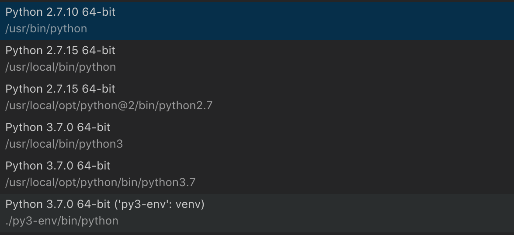

## Version management
- [venv](https://docs.python.org/3/library/venv.html)
  1. first `brew install python` to install latest python3 version.

  2. Then run `python3 -m venv ~/path/to/env` to create directories inside the directory, containing a copy of the Python interpreter, the standard library, and various supporting files.

  3. source to active the env `source ~/path/to/env/bin/activate`
  
  4. for VS code intergation, we need to put the venv directory as a sub-directory under project folder, then specify the python runtime by `command + shift + p` => `Select Interpreter`, choose from the dropdown the one with `venv` specified. 

Detailed doc [here](https://docs.python.org/3/tutorial/venv.html)

- <del>[pyenv](https://github.com/pyenv/pyenv/blob/master/COMMANDS.md) for managing python version. There’s also Anancoda env dedicate to Science calculation & machine learning.</del> Deprecated as of Python 3.6

- <del>[virtualenv](https://github.com/pyenv/pyenv-virtualenv) As it's always a good idea to use a isolated environment for each project, we can use *pyenv-virtualenv* to create an env using a specific python version</del>

- [docker](https://docs.docker.com/docker-for-mac/#explore-the-application-and-run-examples) Should be considered using with vitualenv?


	- create an **image** with command `build` from a root directory which contains at least `Dockerfile`, `requirements.txt` & _some start script_ to run, with tag `-t` to give a tag name

	```bash
	docker build -t friendlyhello .
	```
	
	- create a **container** by using your own image, or the public available images like `ngnix` 

	```bash
	docker run -d -p 4000:80 --name webserver nginx
	# start a new docker container named 'webserver' from ngnix image
	# port remapping of 4000:80, 4000 means the port used when publishing to host OS, and 80 is what the container EXPOSE within the Dockerfile
	# -p for publish, -d for detached mode (running in background)
	# the name is important as you can refer to the container later
	
	docker stop/start webserver
	# will stop/start the container
	```
	
	- use `docker ps` to list all active containers, and `docker ps -a` to list all containers
	- `docker rm -f webserver` will remove the 'webserver' container, but not the `ngnix` image that it created from.
	- use `docker images` to list all images available, and `docker rmi imageName|imageID` to delete an image 

	CHEAT SHEET:
	
	```bash
	docker build -t friendlyname .  # Create image using this directory's Dockerfile
	docker run -p 4000:80 friendlyname  # Run "friendlyname" mapping port 4000 to 80
	docker run -d -p 4000:80 friendlyname         # Same thing, but in detached mode
	docker ps                                 # See a list of all running containers
	docker stop <hash>                     # Gracefully stop the specified container
	docker ps -a           # See a list of all containers, even the ones not running
	docker kill <hash>                   # Force shutdown of the specified container
	docker rm <hash>              # Remove the specified container from this machine
	docker rm $(docker ps -a -q)           # Remove all containers from this machine
	docker images -a                               # Show all images on this machine
	docker rmi <imagename>            # Remove the specified image from this machine
	docker rmi $(docker images -q)             # Remove all images from this machine
	docker login             # Log in this CLI session using your Docker credentials
	docker tag <image> username/repository:tag  # Tag <image> for upload to registry
	docker push username/repository:tag            # Upload tagged image to registry
	docker run username/repository:tag                   # Run image from a registry
	```
	
	- **load-balancing**

	CHEAT SHEET:
	
	```bash
	docker stack ls              # List all running applications on this Docker host
	docker stack deploy -c <composefile> <appname>  # Run the specified Compose file
	docker stack services <appname>       # List the services associated with an app
	docker stack ps <appname>   # List the running containers associated with an app
	docker stack rm <appname>                             # Tear down an application
	```
	- **Docker virtual machine**

	CHEAT SHEET:
	
	```bash
	docker-machine create --driver virtualbox myvm1 # Create a VM (Mac, Win7, Linux)
	docker-machine create -d hyperv --hyperv-virtual-switch "myswitch" myvm1 # Win10
	docker-machine env myvm1                # View basic information about your node
	docker-machine ssh myvm1 "docker node ls"         # List the nodes in your swarm
	docker-machine ssh myvm1 "docker node inspect <node ID>"        # Inspect a node
	docker-machine ssh myvm1 "docker swarm join-token -q worker"   # View join token
	docker-machine ssh myvm1   # Open an SSH session with the VM; type "exit" to end
	docker-machine ssh myvm2 "docker swarm leave"  # Make the worker leave the swarm
	docker-machine ssh myvm1 "docker swarm leave -f" # Make master leave, kill swarm
	docker-machine start myvm1            # Start a VM that is currently not running
	docker-machine stop $(docker-machine ls -q)               # Stop all running VMs
	docker-machine rm $(docker-machine ls -q) # Delete all VMs and their disk images
	docker-machine scp docker-compose.yml myvm1:~     # Copy file to node's home dir
	docker-machine ssh myvm1 "docker stack deploy -c <file> <app>"   # Deploy an app
	```
	
	- **docker debug**

		- if a docker container cannot be lauched, normally you can use `docker logs containerID` to see what's going on. more [commands](https://medium.com/@pimterry/5-ways-to-debug-an-exploding-docker-container-4f729e2c0aa8).
		- go and create a automated bash script like `docker.sh` to automatically rebuild image, then delete exiting container, and create a new one based on the newly built image. Then you can run it by `path/to/the/script.sh` (don't forget `chmod +x` it for once:) every time you have changed the image:

		```bash
		#!/bin/bash
		imageName=xx:my-image
		containerName=my-container
		
		docker build -t $imageName -f Dockerfile  .
		
		echo Delete old container...
		docker rm -f $containerName
		
		echo Run new container...
		docker run -d -p 5000:5000 --name $containerName $imageName
		```
		- once the container is lauched, you can config your editor (VS code in my case) to run the debug. **_Note_**: you should configure your launch.json under environment (be it node or python) to use the setting you have in `Dockerfile`, as well as the settings either in `docker-compose.yml`, or by lauching like `docker run -d -p 4000:80 --name app imageName`, for example:

		```json
		{
            "name": "Docker",
            "type": "python",
            "request": "attach",
            "port": 4000,
            "localRoot": "${workspaceRoot}",
            "remoteRoot": "/app"
        },
		```
		
		For more infos & example in node.js, see [here](https://blog.docker.com/2016/07/live-debugging-docker/).

## Python shell & Editors
For practice, we can simply use **IDLE** provided by python installation, or directly use Terminal app by typing `python` (use `quit()` or command + d to quit python shell and go back to terminal window).

**GoodNews**: as the IDLE is packed when you download python from website, it's not ideal for python versions installed with **pyenv**, we've got [bpython](https://docs.bpython-interpreter.org/contributing.html#getting-your-development-environment-set-up) with code highlight & hint etc right from terminals. (installed with pip)

Simply type `bpython` in terminal window to open a *colored python shell*.

IDLE knows all about Python syntax and offers *completion hints* that pop up when you use a built-in function like `print()`. Python programmers generally refer to built-in functions as **BIFs**. The `print()` BIF displays messages to standard output (usually the screen).
